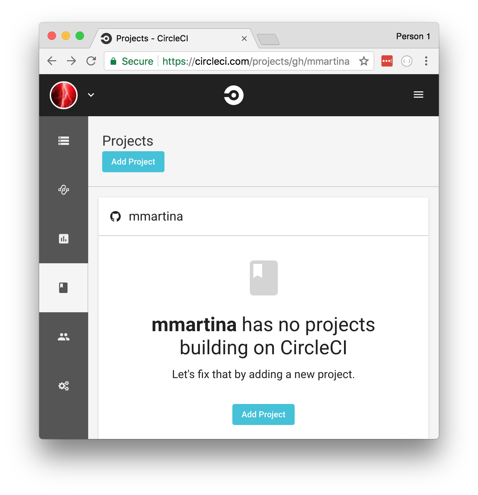
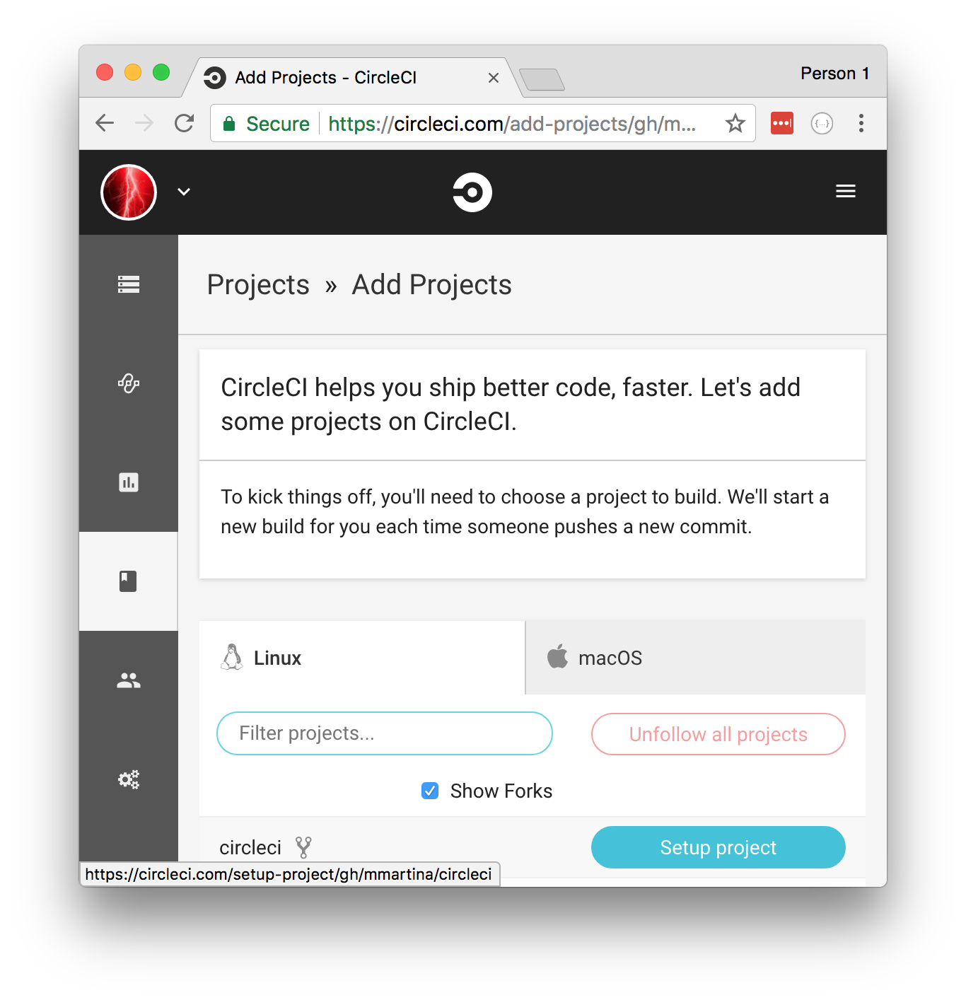
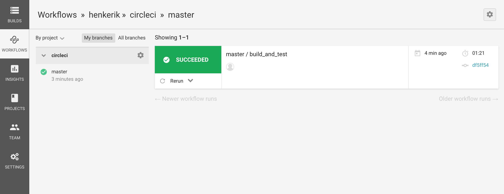
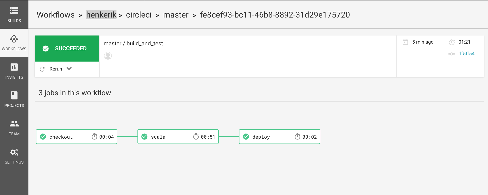

# Get familiar with the CircleCI

## Step 1: Fork the example Github project

Before we start, you will need to fork this Github project. This will allow you to run a couple of CircleCI builds because everyone gets a free 25 hour trial.

## Step 2: Get familiar with the CircleCI configuration

Checkout your fork and take a look at the CircleCI configuration file location at `./circleci/config.yml`. The initial configuration consists of three jobs: 

1. `checkout`: Checks out the sourcecode from Github 
2. `scala`: Run the Scala unit tests
3. `deploy`: Deploys the application

Furthermore, the `workflows` section specifies that these three jobs need to be executed one after the other.   

## Step 3: Get familiar with the CircleCI UI

Push a minor change to the `master` branch in your forked repository. Now, CircleCI will run your workflow, let's take a look at the CircleCI UI:

1. Go to: `https://circleci.com/dashboard`
2. Login using your Github account
3. Select `Projects` menu item on the left in the main menu

 
4. Select the `circleci` repository in the `Linux` tab

5. Click on the `Start building` button.

6. Select the `Workflows` menu item on the left in the main menu
7. Select the `master` branch in the list of branches and wait for the list of workflows the appear on the right (this part of the UI is sometimes a bit slow)

5. Select the workflow on the top of the list. Now you will see a the status of your last workflow:

Click on one of the jobs to see the output of the individual steps. 

